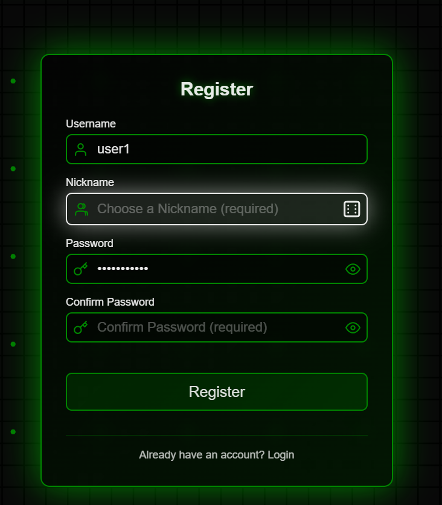
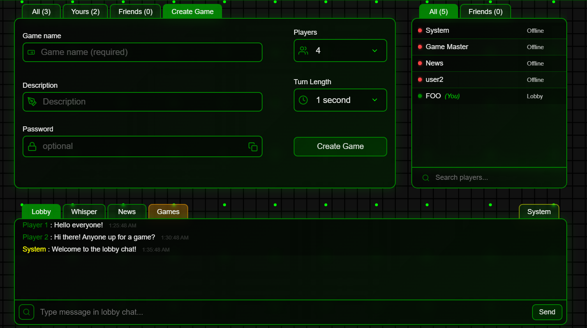
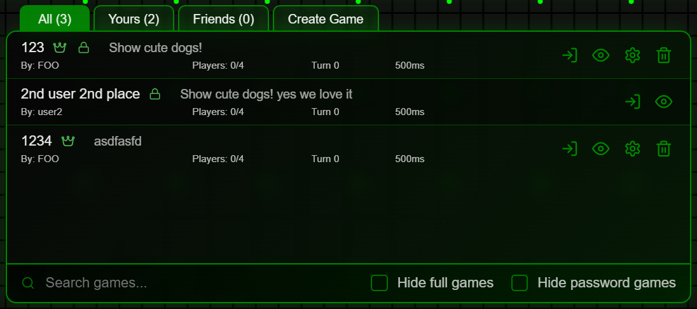
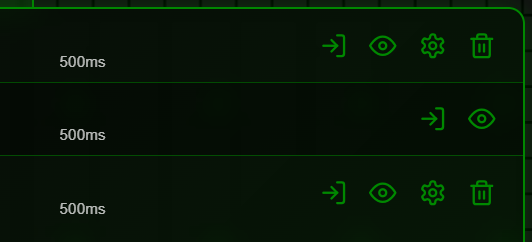
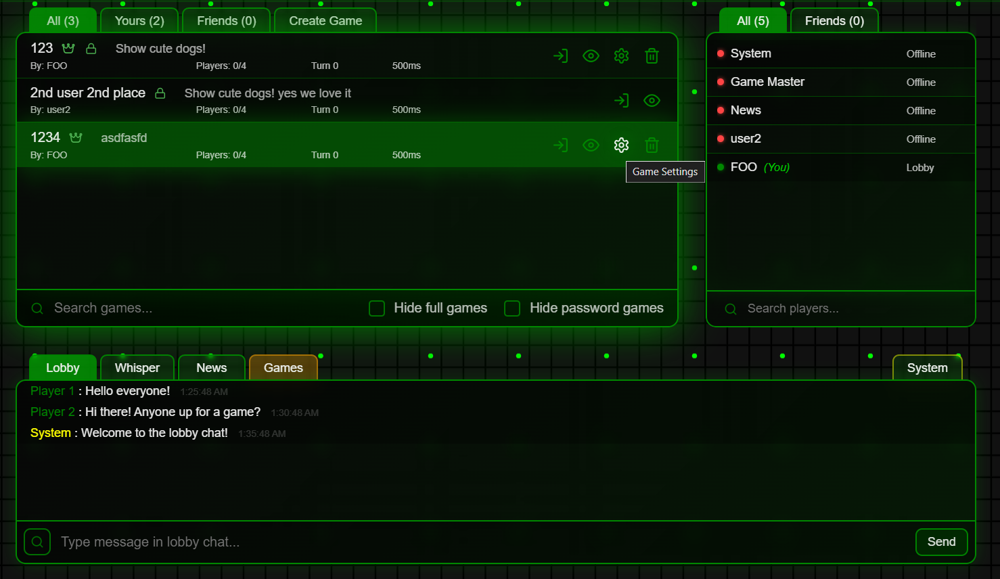
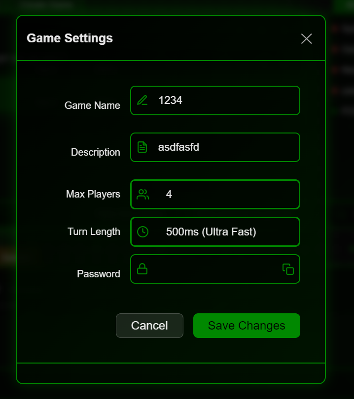
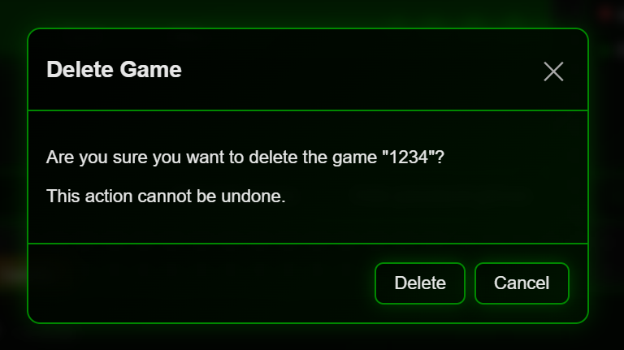
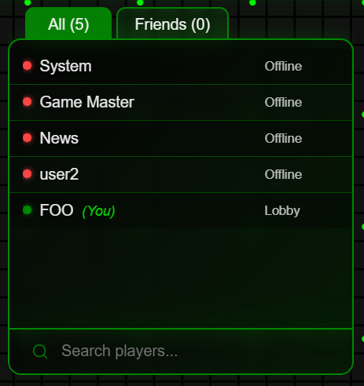
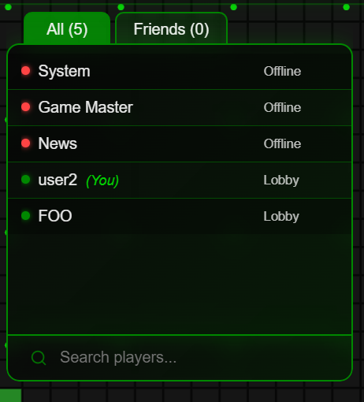

<!-- Improved compatibility of back to top link: See: https://github.com/othneildrew/Best-README-Template/pull/73 -->
<a id="readme-top"></a>
<!--
*** Thanks for checking out the Best-README-Template. If you have a suggestion
*** that would make this better, please fork the repo and create a pull request
*** or simply open an issue with the tag "enhancement".
*** Don't forget to give the project a star!
*** Thanks again! Now go create something AMAZING! :D
-->


<!-- PROJECT SHIELDS -->
<!--
*** I'm using markdown "reference style" links for readability.
*** Reference links are enclosed in brackets [ ] instead of parentheses ( ).
*** See the bottom of this document for the declaration of the reference variables
*** for contributors-url, forks-url, etc. This is an optional, concise syntax you may use.
*** https://www.markdownguide.org/basic-syntax/#reference-style-links
-->
[![Contributors][contributors-shield]][contributors-url]
[![Forks][forks-shield]][forks-url]
[![Stargazers][stars-shield]][stars-url]
[![Issues][issues-shield]][issues-url]
[![MIT License][license-shield]][license-url]
[![LinkedIn][linkedin-shield]][linkedin-url]


<!-- PROJECT LOGO -->
<br />
<div align="center">
  <a href="https://github.com/timotholt/net40k">
    
  </a>

<h3 align="center">net40k</h3>

  <p align="center">
    A Real-Time Chat Lobby For A Future Game With A Working Title Known As Net40k
    <br />
    <a href="https://github.com/timotholt/net40k"><strong>Explore the docs »</strong></a>
    <br />
    <br />
    <a href="https://github.com/timotholt/net40k">View Demo</a>
    ·
    <a href="https://github.com/timotholt/net40k/issues/new?labels=bug&template=bug-report---.md">Report Bug</a>
    ·
    <a href="https://github.com/timotholt/net40k/issues/new?labels=enhancement&template=feature-request---.md">Request Feature</a>
  </p>
</div>


<!-- TABLE OF CONTENTS -->
<details>
  <summary>Table of Contents</summary>
  <ol>
    <li>
      <a href="#about-the-project">About The Project</a>
      <ul>
        <li><a href="#built-with">Built With</a></li>
      </ul>
    </li>
    <li>
      <a href="#getting-started">Getting Started</a>
      <ul>
        <li><a href="#prerequisites">Prerequisites</a></li>
        <li><a href="#installation">Installation</a></li>
      </ul>
    </li>
    <li><a href="#usage">Usage</a></li>
    <li><a href="#roadmap">Roadmap</a></li>
    <li><a href="#contributing">Contributing</a></li>
    <li><a href="#license">License</a></li>
    <li><a href="#contact">Contact</a></li>
    <li><a href="#acknowledgments">Acknowledgments</a></li>
  </ol>
</details>


<!-- ABOUT THE PROJECT -->
## About The Project

This is a game server / lobby / chat framework for a future game.  Includes simple
authentication, chat, and game room management.


[![Product Name Screen Shot][product-screenshot]](https://example.com)


<p align="right">(<a href="#readme-top">back to top</a>)</p>


### Built With

<!-- * [![Next][Next.js]][Next-url] -->
* [![React][React.js]][React-url]
<!-- * [![Vue][Vue.js]][Vue-url] -->
<!-- * [![Angular][Angular.io]][Angular-url] -->
<!-- * [![Svelte][Svelte.dev]][Svelte-url] -->
<!-- * [![Laravel][Laravel.com]][Laravel-url] -->
<!-- * [![Bootstrap][Bootstrap.com]][Bootstrap-url] -->
<!-- * [![JQuery][JQuery.com]][JQuery-url] -->

<p align="right">(<a href="#readme-top">back to top</a>)</p>


# How Requirements Are Met

1. All requirements are met, but the UI is has bugs.

2. CRUD is implemented on the front and backend for game creation,
settings, and delete games.

3. Third party API is used in the registration screen.  When you
click the dice icon in the "nickname" input field, it calls a 
3rd party API to get a random name.

4. MongoDB writing works property.

Those are the critical details of the implemnentation that are
not obvious how the requirements are met.

# Bugs

1. Right mouse click context window shows up on Player list, but isn't doing anything.
2. Password protected games suffer from autocomplete bug,
and you can't join. Regular games work.
3. There is a game screen, but no game.
4. Back button on game screen doesn't work right now.
5. 

## Other Requirements

| Requirement | Weight | Finished |
| :-- | :--: | :--: |
| Project is organized into appropriate files and directories, following best practices. | 2% | ✅ |
| Project contains an appropriate level of comments. | 2% | ✅ |
| Project is pushed to GitHub, and contains a README file that documents the project, including an overall description of the project. | 5% | ✅ |
| Ensure that the program runs without errors | 4% | ✅ |
| Level of effort displayed in creativity, presentation, and user experience. | 5% | ✅ |
| Demonstrate proper usage of ES6 syntax and tools. | 2% | ✅ |
| Use functions and classes to adhere to the DRY principle. | 2% | ✅ |
| Use Promises and async/await, where appropriate. | 2% | ✅ |
| Use Axios or fetch to retrieve data from an API. | 2% | ✅ |
| Use sound programming logic throughout the application. | 2% | ✅ |
| Use MongoDB to create a database for your application. | 5% | ✅ |
| Apply appropriate indexes to your database collections. | 2% | ✅ |
| Create reasonable schemas for your data by following data modeling best practices. | 2% | ✅ |
| Create a RESTful API using Node and Express. | 7% | ✅ |
| Include API routes for all four CRUD operations. | 5% | ✅ |
| Utilize the native MongoDB driver or Mongoose to interface with your database. | 5% | ✅ |
| Include at least one form of user authentication/authorization within the application. | 2% | ✅ |
| Use React to create the application's front-end. | 10% | ✅ |
| Use CSS to style the application. | 5% | ✅ |
| Create at least four different views or pages for the application. | 5% | ✅ |
| Create some form of navigation that is included across the application's pages, utilizing React Router for page rendering | 5% | ✅ |
| Use React Hooks or Redux for application state management. | 5% | ✅ |
| Interface directly with the server and API that you created. | 5% | ✅ |
| Create a short overview of your application. | 1% | ✅ |
| Highlight the use cases of your application. | 1% | ✅ |
| Highlight the technical functionality of the application, from a high-level perspective. | 1% | ✅ |
| Discuss what you have learned through the development of the application. | 1% | ✅ |
| Discuss additional features that could be added to the application in the future. | 1% | ✅ |


### Installation

1. Clone the repo
   ```sh
   git clone https://github.com/timotholt/net40k.git
   ```
2. Install NPM packages
   ```sh
   npm install
   ```
3. Change git remote url to avoid accidental pushes to base project
   ```sh
   git remote set-url origin timotholt/net40k
   git remote -v # confirm the changes
   ```

<p align="right">(<a href="#readme-top">back to top</a>)</p>

<!-- GETTING STARTED -->

## Getting Started

1. You need a .env

'#######################################################
'# .env for the Game Server
'#
'# 1) Choose your port #
'# 2) Choose your database (RAM, Firebase, MongoDb)
'# 3) Enable or disable local caching and cache size
'#######################################################


'#######################################################
'# 1) Choose your server port #
'#######################################################
'PORT=3000
'
'#######################################################
'# 2) Choose your database engine
'#
'#   a) In-Memory Configuration (for debugging)
'#   b) Firebase Configuration (the best)
'#   c) MongoDb Configuration (finiky connection code)
'#   d) (COMING SOON) MongoDb on Azure (woah!)
'#   e) (COMING SOON) Microsoft Azure Cosmo (best free tier)
'#######################################################

'#DB_TYPE=memory
'#DB_TYPE=firestore
'DB_TYPE=mongodb

'#######################################################
'# Firebase Authorization Stuff
'#######################################################

'FIREBASE_API_KEY=
'FIREBASE_AUTH_DOMAIN=
'FIREBASE_PROJECT_ID=
'FIREBASE_STORAGE_BUCKET=
'FIREBASE_MESSAGING_SENDER_ID=
'FIREBASE_APP_ID=

'#######################################################
'# MongoDB Authorization Stuff
'#######################################################

'MONGODB_URI=

'#######################################################
'# 3) Enable/disable caching and the cache size (MB)
'#
'# The cache is write through, so a single write
'# invalidates the cache and forces reads. The cache
'# saves alot of reads.
'#######################################################

'# Cache Configuration
'ENABLE_CACHE=false
'#ENABLE_CACHE=false
'CACHE_SIZE_MB=100

2. To start the server:

cd net40k/backend
npm run dev

3. To start the client:

cd net40k/frontend
npm run dev
open a web browser
http://localhost:5173

Note the requirements did not say that it had to run fromn the dist folder,
so I did not finish that deployment part, even tho it's normal.

4. The server has an interactive startup menu, to clear the databases, run other
tests, etc.  I left it in there cause it's useful.  Especially clearning
databases.


<!-- USAGE EXAMPLES -->
## Usage

1. Create a new account by registring.



Clicking on the dice icon will generate a random nickname from a 3rd party API
known as the Fantasy Name Generator.


2. Login


3. Takes you to the game lobby.  Create a game on the
create game tab (C of CRUD)




Fill in a name and create a game. Don't choose a password,
you can't join password games yet.  When you are done, go back
to the All tab.

4. Go to the All tab and you should see your new game (R of CRUD).


5. The game list...



List of all games on the MongoDb database. It refreshes every 5
seconds so you can open multiple windows with different accounts
and see games from different accounts here.

Games are persistents so logged off players still have games
running on the server.  The final product may take hours or days
to finish a game.

6.  Each game as a row of icons which depends upon if you created
the game or not. JOIN / WATCH / SETTINGS / DELETE



This is where you can do the Update and Delete.

7. Join and Watch take you to the game screen.  Back button in the UI
doesnt work, just hit your browser'a back button.


8. Update a game (U of CRUD) is the gear icon.



Takes you to this screen:



Change the settings you want and hit save or cancel.

9. Delete a game (D of CRUD)

A confirmation will be shown:



10. The chat is all mock data.  Typing doesn't do anything.


11. The Player list is live.  If you log into two different accounts
in two seperate tabs, it shows up properly.






<p align="right">(<a href="#readme-top">back to top</a>)</p>


<!-- ROADMAP -->
## Roadmap

No roadmap right now.  Need to fix existing bugs first.

#See the [open issues](https://github.com/timotholt/net40k/issues) for a full list of proposed features (and known issues).

<p align="right">(<a href="#readme-top">back to top</a>)</p>


<!-- CONTRIBUTING -->
## Contributing

Contributions are what make the open source community such an amazing place to learn, inspire, and create. Any contributions you make are **greatly appreciated**.

If you have a suggestion that would make this better, please fork the repo and create a pull request. You can also simply open an issue with the tag "enhancement".
Don't forget to give the project a star! Thanks again!

1. Fork the Project
2. Create your Feature Branch (`git checkout -b feature/AmazingFeature`)
3. Commit your Changes (`git commit -m 'Add some AmazingFeature'`)
4. Push to the Branch (`git push origin feature/AmazingFeature`)
5. Open a Pull Request

<p align="right">(<a href="#readme-top">back to top</a>)</p>

### Top contributors:

<a href="https://github.com/timotholt/net40k/graphs/contributors">
  
</a>


<!-- LICENSE -->
## License

Distributed under the MIT License. See `LICENSE.txt` for more information.

<p align="right">(<a href="#readme-top">back to top</a>)</p>


<!-- CONTACT -->
## Contact

Your Name - [@OtholtTim](https://x.com/OtholtTim) - timotholt@gmail.com

Project Link: [https://github.com/timotholt/net40k](https://github.com/timotholt/net40k)

<p align="right">(<a href="#readme-top">back to top</a>)</p>


<!-- ACKNOWLEDGMENTS -->
## Acknowledgments

* []()
* []()
* []()

<p align="right">(<a href="#readme-top">back to top</a>)</p>


<p align="right">(<a href="#readme-top">back to top</a>)</p>

<!-- MARKDOWN LINKS & IMAGES -->
<!-- https://www.markdownguide.org/basic-syntax/#reference-style-links -->
[contributors-shield]: https://img.shields.io/github/contributors/timotholt/net40k.svg?style=for-the-badge
[contributors-url]: https://github.com/timotholt/net40k/graphs/contributors
[forks-shield]: https://img.shields.io/github/forks/timotholt/net40k.svg?style=for-the-badge
[forks-url]: https://github.com/timotholt/net40k/network/members
[stars-shield]: https://img.shields.io/github/stars/timotholt/net40k.svg?style=for-the-badge
[stars-url]: https://github.com/timotholt/net40k/stargazers
[issues-shield]: https://img.shields.io/github/issues/timotholt/net40k.svg?style=for-the-badge
[issues-url]: https://github.com/timotholt/net40k/issues
[license-shield]: https://img.shields.io/github/license/timotholt/net40k.svg?style=for-the-badge
[license-url]: https://github.com/timotholt/net40k/blob/master/LICENSE.txt
[linkedin-shield]: https://img.shields.io/badge/-LinkedIn-black.svg?style=for-the-badge&logo=linkedin&colorB=555
[linkedin-url]: https://linkedin.com/in/linkedin_username
[product-screenshot]: images/screenshot.png
[Next.js]: https://img.shields.io/badge/next.js-000000?style=for-the-badge&logo=nextdotjs&logoColor=white
[Next-url]: https://nextjs.org/
[React.js]: https://img.shields.io/badge/React-20232A?style=for-the-badge&logo=react&logoColor=61DAFB
[React-url]: https://reactjs.org/
[Vue.js]: https://img.shields.io/badge/Vue.js-35495E?style=for-the-badge&logo=vuedotjs&logoColor=4FC08D
[Vue-url]: https://vuejs.org/
[Angular.io]: https://img.shields.io/badge/Angular-DD0031?style=for-the-badge&logo=angular&logoColor=white
[Angular-url]: https://angular.io/
[Svelte.dev]: https://img.shields.io/badge/Svelte-4A4A55?style=for-the-badge&logo=svelte&logoColor=FF3E00
[Svelte-url]: https://svelte.dev/
[Laravel.com]: https://img.shields.io/badge/Laravel-FF2D20?style=for-the-badge&logo=laravel&logoColor=white
[Laravel-url]: https://laravel.com
[Bootstrap.com]: https://img.shields.io/badge/Bootstrap-563D7C?style=for-the-badge&logo=bootstrap&logoColor=white
[Bootstrap-url]: https://getbootstrap.com
[JQuery.com]: https://img.shields.io/badge/jQuery-0769AD?style=for-the-badge&logo=jquery&logoColor=white
[JQuery-url]: https://jquery.com 
[linkedin-shield]: https://img.shields.io/badge/-LinkedIn-black.svg?style=for-the-badge&logo=linkedin&colorB=555
[linkedin-url]: https://www.linkedin.com/in/timotholt/
